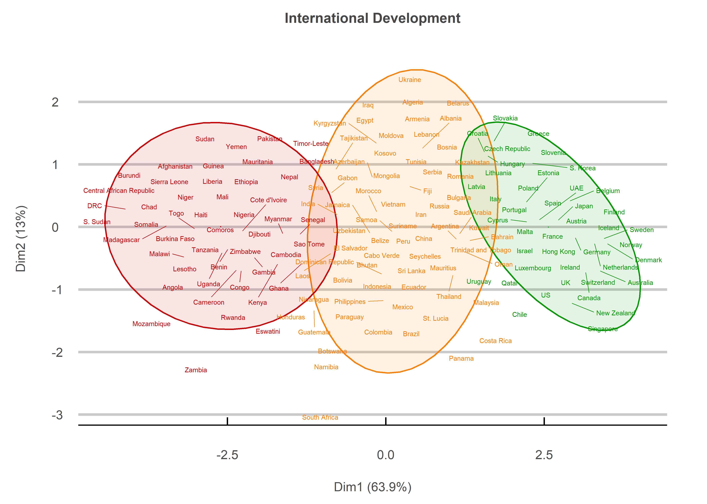

The Usual Suspects
================
Jack Carter
8/15/2022

## **Summary**

Based on eight different development indicators, the world’s countries
can be grouped into three categories. While some previously
underdeveloped countries such as Singapore have shot into the so-called
“first world”, many of the group’s occupants remain the usual
suspects.

 

<!-- -->

 

## **Disclaimer**

Thinking of countries only in terms of these three groups obscures the
fact that development is actually a continuum. Also, while many African
countries may remain in the so-called “third world”, significant
progress has been achieved here in recent decades.

 

## **Method**

### **1) Reconcile Data Sets:**

Data from the World Bank, Transparency International, Worldwide
Governance Indicators and the UN are reconciled by identifying, changing
and dropping relevant country names.

—EXAMPLE CODE SNIPET—

``` r
# creates a list of non-identical country names. 
get_non_identical <- function(list_1, list_2) {
  data <- list_2[which(list_2 %in% list_1 == FALSE)]
  return(data)
}
```

 

### **2) Create Padded NA values:**

Padded NA values are created for each country which is in the World Bank
data frame but not in other data frames.

—EXAMPLE CODE SNIPET—

``` r
# creates a data frame of zeros for missing countries. 
create_padded_values <- function(data_frame) {
  # sets the column names with a value of NA. 
  cols <- data_frame[1,-1]
  for(i in 1:ncol(cols)) {
    cols[1,i] <- NA
  }
  # creates a list of missing countries with col values of NA. 
  added_countries <- list()
  for(i in 1:length(missing)) {
    added_countries[[i]] <- if(!missing[i] %in% data_frame$country) {
      tibble(country = missing[i]) %>%
        cbind(cols) %>%
        tibble()
    }
  }
  # combines all countries into 1 data frame if there are any missing. 
  if(length(added_countries)>0) {
    df <- added_countries %>% 
      reduce(rbind)
  } else {
    return(tibble(country = "No missing countries here!"))
  }
  return(df)
}
```

 

### **3) Remove High NA Entries:**

Countries with a high number of NAs across multiple measures are
identified and removed.

—EXAMPLE CODE SNIPET—

``` r
# gets how many NAs a certain row has. 
get_nas <- function(row) {
  nas <- list()
  for(i in 1:ncol(row)) {
    nas[i] <- if(is.na(row[,i])) 1 else 0
  }
  return(sum(unlist(nas)))
}
```

 

### **4) Check Outliers**

Outliers are checked for and capped by determining whether any of the
values lie further than the interquartile range (IQR) \* 1.5 away from
the mean.

``` r
# checks each column for outliers and caps them at IQR * 1.5. 
cap_col_outliers <- function(column) {
  iqr <- IQR(data[,2][!is.na(data[,2])])
  upper_quantile <- quantile(data[,2][!is.na(data[,2])], 3/4, names=FALSE)
  lower_quantile <- quantile(data[,2][!is.na(data[,2])], 1/4, names=FALSE)
  
  high <- upper_quantile + (iqr*1.5)
  low <- lower_quantile - (iqr*1.5)
  
  outliers <- list()
  for(i in 1:nrow(column)) {
    value <- pull(column[i,])
    outliers[[i]] <- if(!is.na(value) & value > low & value < high) {
      value
    } else {
      if(!is.na(value) & value < low) {
        low
      } else {
        if(!is.na(value) & value > high) {
          high
        } else {
          NA
        }
      }
    }
  }
  return(unlist(outliers))
}
```

 

### **5) Get Z-scores**

The data is standardized by calculating the z-scores as the data point
minus the mean, divided by the standard deviation.

``` r
# gets the z scores for individual columns. 
get_col_z_scores <- function(column) {
  avg <- mean(pull(column[!is.na(column),]))
  std <- sd(pull(column[!is.na(column),]))
  
  z_scores <- list()
  for(i in 1:nrow(column)) {
    z_scores[[i]] <- (pull(column[i,]) - avg) / std
  }
  return(unlist(z_scores))
}
```

 

### **6) Create Indexes**

The individual data columns are then combined into 8 indexes, including
technology, politics, education, health, happiness, economic, equality,
poverty.

``` r
# gets a new index measure by averaging column scores. 
create_index <- function(data, col_names) {
  measures <- data[,col_names]
  cols <- length(col_names)
  index <- list() 
  for(i in 1:nrow(measures)) {
    num <- sum(!is.na(measures[i,c(1:cols)]))
    index[[i]] <- if(sum(is.na(measures[i,c(1:cols)])) >= cols) {
      NA
    } else {
      sum(measures[i,which(!is.na(measures[i,c(1:cols)]))]) / num
    }
  }
  unlist(index)
}
```

 

### **7) Impute NAs**

The remaining NA values are then imputed by taking a grouped average
based on a complete column with the most variability.

``` r
# imputes missing values by taking a grouped average based on a complete 
# column we have full data for with the most variability.  
fill_NAs <- function(data, measure) {
  impute_var <- get_best_impute_var(data)
  
  # gets the grouped averages for missing values. 
  imputed_values <- data %>%
    mutate(impute_var = round(eval(parse(text=impute_var)))) %>%
    group_by(impute_var) %>%
    filter(!is.na(eval(parse(text=measure)))) %>%
    summarise(avg = mean(eval(parse(text=measure))))
  
  # imputes the missing values for the target column. 
  NAs <- data[is.na(data[,measure]),]
  imputations <- list()
  for(i in 1:nrow(NAs)) {
    imputations[[i]] <- imputed_values$avg[which(pull(imputed_values["impute_var"]) == pull(round(NAs[i,impute_var])))]
  }
  data[is.na(data[,measure]),measure] <- unlist(imputations)
  return(data[,measure])
}
```

 

### **8) Visualize Data**

The data is visualized with the use of a K-means clustering algorithm
and the factoextra visualization package

``` r
# visualizes the data with the factoextra package. 
plot <- fviz_cluster(object=kmeans.res,
             data=data,
             stand=FALSE,
             geom = "text",
             repel=TRUE,
             ellipse.type = "t",
             ellipse.level=0.95,
             ellipse.alpha = 0.1,
             labelsize = 8) +
  scale_colour_manual(values = cols) +
  scale_fill_manual(values = cols) + 
  ggtitle("International Development") +
  my_theme +
  theme(legend.position="none")
```

 

## **Sources**

  - Transaprency International (2022) <https://www.transparency.org/en/>

  - WGI (2022) <http://info.worldbank.org/governance/wgi/>

  - World Bank (2022) <https://data.worldbank.org/>

  - World Happiness Report (2022)
    <https://worldhappiness.report/ed/2022/>
